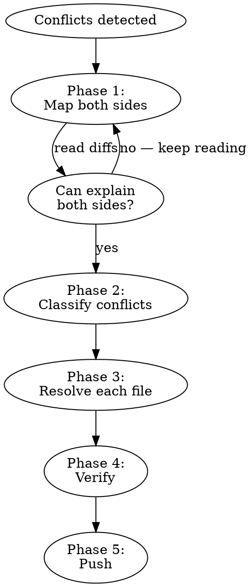

# Resolve Conflicts

## Overview

Conflict resolution is **reading comprehension, not surgery.** Understand what both sides contributed before touching anything. The #1 failure mode is acting before understanding — trying mechanical fixes that create cascading problems.

## The Rule

```
NEVER touch the tree until you can explain what both sides changed and why.
```

## Process



### Phase 1: Map Both Sides (DO THIS FIRST)

Before resolving anything, understand the full picture:

```bash
jj git fetch
jj status                        # See conflicted files
jj log -r @                      # Understand commit relationships
jj resolve --list                # List all conflicted files with conflict types
```

**For each parent/side of the conflict:**
```bash
jj diff -r <parent-rev> --stat   # What files did this side touch?
jj diff -r <parent-rev>          # What content changes did it make?
```

**You must be able to answer:**
1. What did side A change? (paths AND content)
2. What did side B change? (paths AND content)
3. Do they overlap? Where?
4. Which side's version is better for each overlapping area, and why?

**If you can't answer all four, keep reading. Do not proceed.**

### Phase 2: Classify Conflicts

| Conflict Type | What It Looks Like | Resolution |
|---|---|---|
| **Path-only** | File moved/renamed on one side, modified on other | Pick the correct path, keep the content changes |
| **Content-only** | Both sides modified same lines | Read both changes, combine or pick the better version |
| **Path + content** | File moved AND modified differently on each side | Resolve path first (where should it live?), then resolve content |
| **Delete vs modify** | One side deleted file, other modified it | Decide if file should exist; if yes, keep modifications |

**File moves are the most deceptive.** A move commit that also modifies content creates TWO problems at once. Always check `--stat` for line counts — `0 insertions, 0 deletions` means pure move, anything else means move + content changes.

### Phase 3: Resolve Each File

Read the conflict markers in each file:
- `+++++++` sections are snapshots (full content of one side)
- `%%%%%%%` sections are diffs (changes to apply)
- Pick the right content, remove all markers

**For each file, document your choice:** "Taking side B because it has the grading cache improvement" — not just "taking side B."

### Phase 4: Verify

```bash
jj status                        # No conflicts remaining
# Run project quality checks (types, lint, tests)
```

If checks fail due to resolution, fix. If unrelated, note separately.

### Phase 5: Push

```bash
jj bookmark list                 # Check bookmarks
jj git push                      # Push resolved state
```

## Red Flags — STOP and Rethink

| What you're about to do | Why it's wrong |
|---|---|
| Rebase to bypass a conflicting parent | You're avoiding the conflict, not resolving it. The parent's changes get lost. |
| Insert a "fix-up" commit to reverse changes | This creates a new problem to solve instead of solving the original one. |
| `jj undo` then retry a different approach | Undo loops cause divergent commits in shared repos. One deliberate fix, not trial-and-error. |
| Abandon divergent commits to clean up | Verify they're actually stale first. Check immutability. Don't touch what you don't understand. |
| Say changes are "superseded" without checking | Read the actual file content on both sides. "Probably already covered" is not verification. |
| Chain a second fix after the first one didn't fully work | Stop. Re-read Phase 1. You missed something. |

## Common Mistake: Moves That Also Modify

The most dangerous conflict pattern: a commit that moves files to a new path AND changes their content.

```bash
# This looks innocent in --stat:
# {old/path => new/path}/file.py | 29 +-
#                                  ^^^^ THESE ARE CONTENT CHANGES
```

If you only reverse the path (copying files back), you get the wrong content — either the old version or the new version, but not both sides' changes merged. You must:
1. Identify which content changes each side made
2. Decide where files should live (path resolution)
3. Put the right content at the right path (content resolution)

## When Conflicts Are Complex

If a conflict involves more than path + content (e.g., architectural disagreements, mutually exclusive approaches), **explain both sides and ask the user** before resolving. Don't guess.

**Done when:** All conflicts resolved, checks pass, changes pushed, no divergent commits created.
